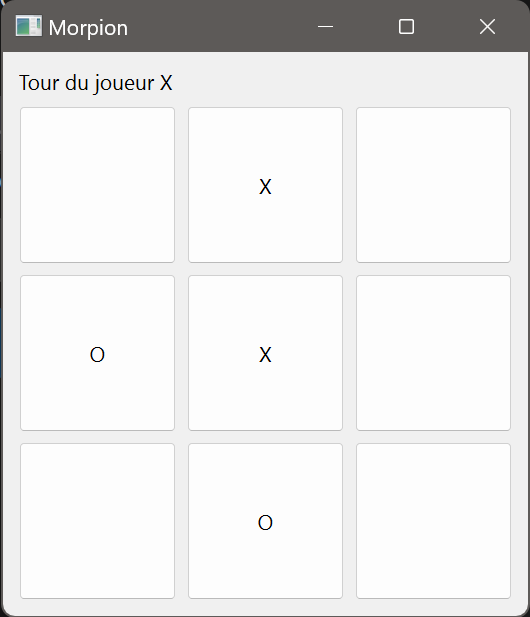

# Règles du Morpion (Tic-Tac-Toe) :

    1. Le jeu se joue sur une grille de 3x3.
    2. Deux joueurs s'affrontent, l'un utilisant X et l'autre O.
    3. Le joueur qui parvient à aligner trois de ses symboles horizontalement, verticalement ou en diagonale gagne.
    4. Si la grille est remplie et aucun joueur n'a aligné trois symboles, la partie est déclarée nulle.
    5. Les joueurs alternent les tours en plaçant leur symbole dans une case vide.
    6. Le jeu se termine dès qu'il y a un gagnant ou que la partie est nulle.

    Bonne chance et amusez-vous !

